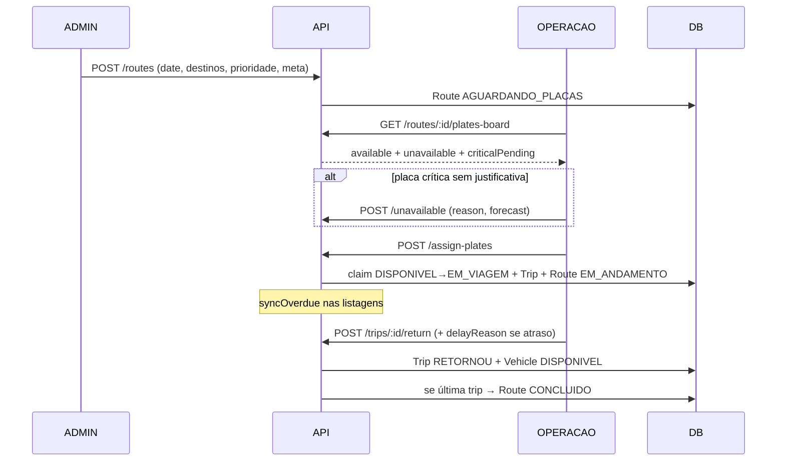

# FrotaTMS — Especificação completa (funcionamento e lógica)

Documento de handoff para outras IAs / engenheiros / produto.  
**Escopo exclusivo:** pasta `frota-tms/` (sistema independente).  
**Não misturar** com FilaDock (Next.js na raiz do monorepo) — auth, DB e deploy separados.

Última atualização: Jul/2026.

> **Evolução operacional (Mesa):** ver também `AUDITORIA-PRODUTO.md`.  
> Novas telas Admin: `/mesa`, `/meu-dia`, `/planejamento`, `/alertas`.  
> Handoff: rota `RASCUNHO` → **Enviar para Operação** → `AGUARDANDO_PLACAS`.  
> Operação: tela simplificada com cobertura (Necessário / Selecionados / Faltam).  
> API planejamento: `/api/planning/*` + import stub Excel.

---

## 0. Como usar este documento com outra IA

Cole o **prompt da seção 16** + **este arquivo inteiro**. Peça melhorias, ideias de UX, roadmap ou redesign de regras — sem alterar o escopo FilaDock.

---

## 1. O que é o produto

Sistema web de **roteirização e gestão de frota** para carregamento de **motos** (capacidade em `capacityMotos`) com destino a **concessionárias**.

Substitui controle manual (papel/planilha) com:

1. Cadastro de frota e concessionárias  
2. Roteiros multi-destino (1..N concessionárias) com prioridade manual e meta de placas  
3. Definição de placas pela operação (empresa terceira)  
4. Controle de viagens / retornos com previsão automática  
5. Justificativas quando a placa não está disponível na data **ou** atrasa o retorno  
6. Dashboard operacional, histórico, busca, relatórios Excel/PDF, usuários e auditoria  
7. Atualização em tempo real via Socket.IO  

### Processo real do cliente (fonte de verdade)

```
ADMIN cria roteiro
  → data de início
  → saída SEMPRE 06:00
  → várias concessionárias
  → prioridade? (sim/não + texto)
  → meta de placas (opcional)

SISTEMA lista placas DISPONÍVEIS
  ← automação de retorno (status DISPONIVEL + sem viagem aberta)

OPERAÇÃO (terceira) em "Definir Placas"
  → escolhe placas livres e confirma
  → se placa NÃO disponível: justifica + previsão de disponibilidade
  → se placa JÁ DEVERIA ter retornado (expectedReturn ≤ 06:00 do roteiro)
    e sem justificativa → TRAVA Confirmar

VIAGEM
  → saída = date @ 06:00
  → previsão retorno = saída + ceil(avgTravelDays do destino mais longe)
  → sync atraso automático
  → retorno: se atrasado, justificativa OBRIGATÓRIA
  → veículo volta ao pool DISPONIVEL
```

---

## 2. Stack e estrutura

| Camada | Tecnologia |
|--------|------------|
| Front | React 19 + TypeScript + Vite + Tailwind + React Query + Zustand + React Router + Socket.IO client + Recharts + dnd-kit |
| Back | Node.js + Express 5 + Prisma + JWT + Socket.IO + Zod + ExcelJS + PDFKit |
| DB | SQLite (dev) · PostgreSQL (produção / Docker) |

**Como sobe**

- Dev: API `:4000` + Vite `:5173` (proxy `/api` e `/socket.io`)
- Prod: imagem única — API serve o front (`web/dist` → `public`) na mesma origem

```
frota-tms/
  api/                 # Express + Prisma
    prisma/schema.prisma
    prisma/seed.ts
    prisma/data/       # JSON frota + concessionárias reais
    src/
      index.ts
      routes/          # auth, vehicles, dealerships, routes, trips, dashboard, history, search, reports
      middleware/auth.ts
      utils/status.ts  # cores, 06:00, expectedReturn
      types/enums.ts
  web/                 # React SPA
    src/pages/         # telas
    src/App.tsx        # rotas + RoleGate
  Dockerfile
  docker-compose.yml
  render.yaml
  scripts/backup.sh
  docs/                # este arquivo + ARQUITETURA.md
```

**Nota:** `api/src/routes/products.ts` existe no disco mas **não está montado** em `index.ts`. Prioridade hoje é só flag manual no roteiro.

---

## 3. Perfis (RBAC)

| Role | Quem é | Pode |
|------|--------|------|
| **ADMIN** | Planejamento / dono | Tudo: roteiros, frota, concessionárias, usuários, auditoria, definir placas, retornos |
| **OPERACAO** | Empresa terceira / pátio | Definir placas, justificar indisponibilidade, informar atraso, confirmar retorno |
| **CONSULTA** | Leitura | Dashboard, frota, roteiros (sem editar), viagens, histórico, relatórios, busca |

### Auth

- Login → JWT Bearer  
- Middleware `authenticate`: decodifica token e **recarrega usuário do DB** (`active` obrigatório)  
- Produção: `JWT_SECRET` fraco (<24 chars) → falha  
- Socket.IO exige o mesmo JWT (`handshake.auth.token` ou `Authorization`)  
- Troca de senha: `POST /api/auth/change-password` (qualquer autenticado)  
- Logout no front limpa token + cache React Query  

---

## 4. Máquinas de estado

### 4.1 Veículo (`Vehicle.status`)

```
DISPONIVEL ──assign-plates──► EM_VIAGEM ──return──► DISPONIVEL
     │                              │
     │                         delay-report
     │                         (markUnavailable)
     │                              ▼
     └──── manutenção/admin ──► BLOQUEADO / EM_MANUTENCAO
```

Valores: `DISPONIVEL` | `EM_VIAGEM` | `EM_CARREGAMENTO` | `EM_MANUTENCAO` | `BLOQUEADO`  
Tipo: `TRUCK` | `CARRETA`  
Capacidade: `capacityMotos` (float) — **unidade oficial = motos**

### 4.2 Roteiro (`Route.status`)

```
(criação) → AGUARDANDO_PLACAS
RASCUNHO também aceito na atribuição
       │
       ▼ assign-plates
  EM_ANDAMENTO
       │
       ▼ última viagem retorna
  CONCLUIDO

Cancelamento (soft): → CANCELADO
  bloqueado se houver viagem EM_ANDAMENTO/ATRASADO
```

### 4.3 Viagem (`Trip.status`)

```
EM_ANDAMENTO ──(expectedReturn < now)──► ATRASADO
     │                                      │
     └────────────── return ◄───────────────┘
                         │
                         ▼
                     RETORNOU
```

Sync de atraso: ao listar viagens/retornos, `EM_ANDAMENTO` com `expectedReturn < now` vira `ATRASADO`.

---

## 5. Regras de negócio detalhadas

### 5.1 Criação de roteiro (ADMIN)

Body (`POST /api/routes`):

```json
{
  "name": "string ≥2",
  "date": "ISO date",
  "dealershipIds": ["id1", "id2", "..."],
  "region": "opcional",
  "notes": "opcional",
  "hasPriority": true,
  "priorityNotes": "texto se prioridade",
  "plannedVehicleCount": 5
}
```

- `dealershipId` legado = **primeira** parada  
- `region` = regiões únicas dos destinos unidas por ` / `  
- `RouteDealership.order` = ordem do array  
- Status default: `AGUARDANDO_PLACAS`  
- Prioridade é **manual** (`hasPriority` + `priorityExpiryDate` + `priorityNotes`) — não vem de produtos
- Se prioridade por vencimento: informar **menor vencimento** (aceita data retroativa para o operador se atentar) 

### 5.2 Saída oficial = 06:00

Função `routeDepartureAt(route.date)`:

- Extrai `YYYY-MM-DD` do valor persistido  
- Retorna `new Date(`${datePart}T06:00:00`)`  
- Evita virar o dia por fuso ao serializar  

**Toda viagem** do roteiro usa esse horário como `departureAt`.

### 5.3 Destino mais longe (PAD × concessionárias)

Usado para `trip.dealershipId` e previsão de retorno.

**PAD** (coordenadas oficiais): `-12.809004, -38.428719`

Para cada parada do roteiro:

1. Distância haversine **PAD → coordenadas da cidade** da concessionária  
2. Dias médios = `(distanceKm * 2) / 400` (ida+volta, mín. 1 dia)  
3. Escolhe o destino com **maior distância do PAD** (empate → maior dias)

```
expectedReturn = departureAt + ceil(padAvgTravelDays do destino mais longe)
```

O cálculo é feito **ao vivo** na atribuição de placa (não depende só do campo armazenado).
Campos `Dealership.distanceKm` / `avgTravelDays` são espelho persistido do mesmo cálculo.
### 5.4 Tipo de veículo permitido

Cada concessionária: `allowedVehicle` = `TRUCK` | `CARRETA` | `AMBOS`  

Ao atribuir placa: o tipo deve ser aceito em **TODOS** os destinos do roteiro.  
Se um destino restringe (ex.: só CARRETA) e a placa é TRUCK → erro 400.

### 5.5 Placa disponível (pool)

Uma placa entra no pool **available** do plates-board se:

- `vehicle.status === DISPONIVEL`  
- **E** não existe trip aberta (`EM_ANDAMENTO` | `ATRASADO`)  

Senão → **unavailable**.

### 5.6 Placas indisponíveis + justificativa

`POST /api/routes/:id/unavailable`:

```json
{
  "vehicleId": "...",
  "reason": "mín. 5 caracteres",
  "availableAtForecast": "ISO datetime"
}
```

- Upsert por `(routeId, vehicleId)`  
- Bloqueado se a placa já está livre (não precisa justificar)  
- Histórico: action `INDISPONIVEL_ROTEIRO`  

**Crítico (`shouldBeAvailable`)** quando:

- Tem viagem aberta com `expectedReturn <= loadAt` (06:00 do roteiro), **OU**  
- Status `BLOQUEADO` / `EM_MANUTENCAO`  

Se crítico e sem `report` → `needsJustification: true`  
UI **trava Confirmar** se `criticalPendingJustifications > 0`.

### 5.7 assign-plates (atômico)

`POST /api/routes/:id/assign-plates` — ADMIN | OPERACAO

```json
{
  "vehicleIds": ["id1", "id2"],
  "driverName": "opcional default",
  "drivers": { "vehicleId": "nome motorista" }
}
```

Roteiro deve estar em: `AGUARDANDO_PLACAS` | `RASCUNHO` | `EM_ANDAMENTO`.

Dentro de **uma transação**, para cada placa:

1. Claim atômico: `updateMany where status=DISPONIVEL → EM_VIAGEM` (count deve ser 1)  
2. Checa ausência de trip aberta  
3. Valida `allowedVehicle` em todos os stops  
4. Upsert `RouteVehicle`  
5. Cria `Trip` com `departureAt`, `expectedReturn`, `dealershipId=farthest`  
6. `VehicleHistory` action `SAIDA`  
7. Roteiro → `EM_ANDAMENTO`  

Motorista: `drivers[id]` → `driverName` → `vehicle.defaultDriver`.

Eventos Socket: `fleet:changed`, `trips:changed`, `routes:changed`.

### 5.8 Informe de atraso

`POST /api/trips/:id/delay-report`:

```json
{
  "reason": "mín. 5 chars",
  "markUnavailable": false,
  "unavailableReason": "opcional"
}
```

- Grava `delayReason`, `delayReportedAt`, `delayReportedById`  
- Se overdue → status `ATRASADO`  
- Se `markUnavailable` → veículo `BLOQUEADO` + history `INDISPONIVEL`  

### 5.9 Retorno

`POST /api/trips/:id/return`:

```json
{
  "delayReason": "obrigatório se atrasado (mín. 5)",
  "notes": "opcional"
}
```

- Se atrasado e sem justificativa (body nem trip) → `400 DELAY_REASON_REQUIRED`  
- Viagem → `RETORNOU`, `returnedAt=now`  
- Veículo → `DISPONIVEL` (limpa unavailable da trip)  
- Se não restar viagem aberta no roteiro → roteiro `CONCLUIDO`  

### 5.10 Cores das placas (UI)

| Cor | Significado |
|-----|-------------|
| Verde | Disponível / em prazo (≥2 dias para retorno) |
| Amarelo | `EM_CARREGAMENTO` |
| Azul | Retorna hoje |
| Laranja | Retorna amanhã |
| Vermelho | Atraso / EM_VIAGEM sem previsão |
| Preto | Manutenção / bloqueado |

### 5.11 Capacidade

Unidade oficial: **motos** (`capacityMotos`). Não usar toneladas/paletes.

### 5.12 Produtos prioritários

**Removidos da UI e da API montada.**  
Schema ainda tem `PriorityProduct` / `RouteProduct` (legado).  
Prioridade operacional = flag manual no roteiro.

---

## 6. Telas (front)

| Rota | Página | Quem |
|------|--------|------|
| `/login` | Login | Público |
| `/` | Dashboard (KPIs + alertas ops + carregamento de hoje) | Auth |
| `/frota`, `/frota/:id` | Frota / detalhe | Auth (CRUD ADMIN) |
| `/concessionarias` | Concessionárias | Auth (CRUD ADMIN; delete soft) |
| `/roteiros` | Lista | Auth |
| `/roteiros/novo`, `/roteiros/:id` | Form | **ADMIN** |
| `/definir-placas` | DnD placas + justificativas | **ADMIN \| OPERACAO** |
| `/viagens` | Lista + delay-report | Auth (ações ops) |
| `/retornos` | Buckets: overdue / hoje / amanhã / 2d / later | **ADMIN \| OPERACAO** |
| `/historico` | Filtros | Auth |
| `/relatorios` | Excel/PDF | Auth |
| `/usuarios` | CRUD users | **ADMIN** |
| `/auditoria` | Audit log | **ADMIN** |
| `/busca` | Busca global | Auth |

### UX chave — Definir Placas

1. Seleciona roteiro pendente  
2. Carrega `GET /routes/:id/plates-board`  
3. Coluna disponíveis (arrastar/usar) vs indisponíveis  
4. Em indisponível: modal motivo + previsão  
5. Banner se críticas pendentes  
6. Confirmar desabilitado enquanto houver crítica sem justificativa  
7. Confirma → `assign-plates`  

### Dashboard

Além de frota:

- `ops.awaitingPlates`  
- `ops.justificativasPendentes` (placas que já deveriam ter voltado até o load sem report)  
- `ops.atrasadasSemJustificativa`  
- `ops.priorityRoutes`  
- `hojeCarregamento[]`: assigned / planned / coverage% / destinations  

---

## 7. Modelo de dados (Prisma)

### Entidades

| Model | Papel |
|-------|-------|
| **User** | role, active, passwordHash |
| **Vehicle** | plate, type, capacityMotos, status, defaultDriver |
| **Dealership** | city, region, distanceKm, avgTravelDays, allowedVehicle, active |
| **Route** | date, hasPriority, priorityExpiryDate, priorityNotes, plannedVehicleCount, status |
| **RouteDealership** | order; unique(routeId, dealershipId) |
| **RouteVehicle** | vínculo placa↔roteiro; unique(routeId, vehicleId) |
| **PlateUnavailability** | reason + availableAtForecast; unique(routeId, vehicleId) |
| **Trip** | departureAt, expectedReturn, delayReason, status, dealershipId=farthest |
| **VehicleHistory** | SAIDA / RETORNO / JUSTIFICATIVA_ATRASO / INDISPONIVEL / … |
| **AuditLog** | CREATE/UPDATE/ASSIGN_PLATES/RETURN/… |
| **PriorityProduct / RouteProduct** | legado, não montado na API |

### Soft-delete

- Concessionária: `active=false`  
- Roteiro: status `CANCELADO`  
- Veículo: hard delete bloqueado se houver histórico de trips  

---

## 8. Mapa da API

Base: `/api` — quase tudo exige JWT.

| Grupo | Endpoints | Roles |
|-------|-----------|-------|
| Health | `GET /health` | Público (checa DB) |
| Auth | `POST /auth/login`, `GET /auth/me`, `POST /auth/change-password` | | 
| Users | `GET/POST /auth/users`, `PATCH /auth/users/:id` | ADMIN |
| Vehicles | `GET /`, `/available`, `/:id`; `POST/PUT/DELETE` | write ADMIN |
| Dealerships | CRUD; list default só `active`; `GET /filters/meta` | write ADMIN |
| Routes | `GET /`, `GET /:id`; `POST/PUT/DELETE` ADMIN | |
| Plates | `GET /:id/plates-board`, `POST /:id/unavailable`, `POST /:id/assign-plates` | ADMIN\|OPERACAO |
| Trips | `GET /`, `GET /returns`; `POST /:id/delay-report`, `POST /:id/return` | write ADMIN\|OPERACAO |
| Dashboard | `GET /dashboard` | Auth |
| History | `/vehicle/:id`, `/trips`; `/audit` | audit ADMIN |
| Search | `GET /search?q=` | Auth |
| Reports | `/reports/excel/:type`, `/pdf/:type` | Auth |

### Realtime

Eventos: `routes:changed`, `fleet:changed`, `trips:changed`  
Front (`RealtimeProvider`) invalida queries React Query.

### Returns buckets (`GET /trips/returns`)

```json
{
  "overdue": [],
  "today": [],
  "tomorrow": [],
  "in2Days": [],
  "later": []
}
```

Cada trip inclui `overdue`, `color`, `needsDelayReason`.

---

## 9. Diagramas de fluxo

### Fluxo ponta a ponta



### Decisão “pode confirmar placas?”

```
criticalPending = unavailable.filter(shouldBeAvailable && !report).length
Confirmar habilitado <=> criticalPending === 0 && selectedPlates.length > 0
```

---

## 10. Dados seed / demo

| Email | Senha | Role |
|-------|-------|------|
| a@a.com | 1 | ADMIN |
| o@o.com | 1 | OPERACAO |
| c@c.com | 1 | CONSULTA |

- ~22 veículos + ~72 concessionárias (JSON em `api/prisma/data/`)  
- Seed **apaga dados** — produção só com `FORCE_SEED=true` + `SEED_ON_START=true` no bootstrap  
- Login em produção **não** pré-preenche credenciais demo  

---

## 11. Deploy e ops

- Docker Compose: Postgres + API  
- Bootstrap: `SEED_ON_START=true FORCE_SEED=true docker compose up --build -d`  
- Contínuo: seed desligado  
- Env: `DATABASE_URL`, `JWT_SECRET` (≥24), `NODE_ENV=production`, `CORS_ORIGIN`  
- Backup: `./scripts/backup.sh`  
- Docs: `DEPLOY-PRODUCAO.md`, `README.md`, `QUICKSTART.md`  
- Schema: hoje `prisma db push` (migrations formais = lacuna)  

---

## 12. Decisões de produto conscientes

1. Capacidade em **motos**  
2. Prioridade **manual** no roteiro (produtos fora da UI)  
3. Multi-destino; previsão pelo **destino mais longe**  
4. Saída sempre **06:00**  
5. Operação justifica indisponibilidade **antes** do carregamento e atraso **no retorno**  
6. Isolado do FilaDock  
7. Claim atômico de placa (anti double-booking)  
8. Meta de placas (`plannedVehicleCount`) opcional, usada para % cobertura  

---

## 13. Arquivos-chave

| Área | Path |
|------|------|
| Schema | `api/prisma/schema.prisma` |
| Enums | `api/src/types/enums.ts` |
| Auth middleware | `api/src/middleware/auth.ts` |
| JWT | `api/src/lib/token.ts` |
| 06:00 / cores | `api/src/utils/status.ts` |
| Rotas/placas | `api/src/routes/routes.ts` |
| Viagens/retornos | `api/src/routes/trips.ts` |
| Dashboard | `api/src/routes/dashboard.ts` |
| Bootstrap API | `api/src/index.ts` |
| Rotas front | `web/src/App.tsx` |
| Definir placas | `web/src/pages/AssignPlates.tsx` |
| Form roteiro | `web/src/pages/RouteForm.tsx` |
| Dashboard UI | `web/src/pages/Dashboard.tsx` |
| Retornos | `web/src/pages/Returns.tsx` |
| Viagens | `web/src/pages/Trips.tsx` |

---

## 14. Lacunas / oportunidades (brief de evolução)

### Processo / produto

- [ ] Meta de placas obrigatória vs opcional  
- [ ] Mín/máx de placas por tipo (truck/carreta) no roteiro  
- [ ] Ordem de prioridade automática entre roteiros do mesmo dia  
- [ ] Notificações (WhatsApp/e-mail) para atraso e justificativa pendente  
- [ ] App mobile leve (definir placas + retorno + justificativa)  
- [ ] SLA: tempo máximo sem justificativa após `shouldBeAvailable`  
- [ ] Painel “buracos de frota” por data (planejado vs disponível)  
- [ ] Reativação inteligente de produtos prioritários (vencimento)  
- [ ] Multi-parada com tempo acumulado (hoje previsão = só farthest)  
- [ ] Liberação parcial: atribuir menos que a meta e manter roteiro aberto  

### Técnico

- [ ] Postgres default + migrations formais  
- [ ] Testes automatizados (API + E2E fluxo placas)  
- [ ] Paginação em histórico/viagens  
- [ ] Soft-delete de veículo  
- [ ] Rate limit / refresh token  
- [ ] Fuso explícito `America/Bahia` para 06:00  
- [ ] Remover schema morto de PriorityProduct ou remontar módulo  
- [ ] Idempotência explícita em assign-plates  

### UX

- [ ] Wizard guiado Admin → Operação no primeiro uso  
- [ ] Checklist de cobertura vs meta antes de confirmar  
- [ ] Mapa simples dos destinos do roteiro  
- [ ] Modo offline leve para pátio  
- [ ] Alertas push no dashboard com deep-link para Definir Placas  

---

## 15. Glossário rápido

| Termo | Significado |
|-------|-------------|
| Placa | Veículo da frota (identificado pela placa) |
| Roteiro | Plano de carregamento numa data (vários destinos) |
| Definir placas | Atribuir veículos disponíveis ao roteiro |
| Farthest | Destino com maior tempo/distância → define retorno |
| shouldBeAvailable | Já deveria estar livre para o load das 06:00 |
| PlateUnavailability | Justificativa + previsão quando não pode carregar |
| Cobertura | assignedPlates / plannedVehicleCount × 100 |

---

## 16. Prompt sugerido para outra IA

```
Você é engenheiro de produto/software sênior. Analise a especificação completa do
FrotaTMS (documento anexo) e proponha melhorias priorizadas (P0 / P1 / P2).

Contexto do processo real:
1) Admin lança roteiro com data, saída fixa 06:00, multi-concessionária,
   prioridade manual e meta de placas
2) Sistema lista placas disponíveis pela automação de retorno
3) Operação (empresa terceira) define placas; se indisponível, justifica +
   previsão; placas que já deveriam ter voltado sem justificativa travam o Confirm
4) Viagens/retornos: previsão pelo destino mais longe; atraso exige justificativa;
   veículo volta ao pool

Restrições:
- Não misturar com FilaDock
- Capacidade em motos
- Multi-concessionária por roteiro
- RBAC Admin / Operação / Consulta
- Preferir evoluções incrementais sobre rewrite

Entregue:
1) Diagnóstico dos gargalos do processo atual
2) Ideias de UX e regras de negócio (com impacto operacional)
3) Mudanças de modelo de dados se necessário
4) Roadmap curto de implementação (P0→P2) com arquivos/áreas tocadas
5) Riscos e o que NÃO mudar
```

Cole este arquivo inteiro após o prompt.

---

## 17. Resumo em 10 linhas (elevator)

1. FrotaTMS gerencia frota de trucks/carretas que levam motos a concessionárias.  
2. Admin cria roteiro multi-destino com saída sempre 06:00.  
3. Operação atribui placas disponíveis (claim atômico).  
4. Indisponíveis exigem justificativa + previsão; críticas travam confirmação.  
5. Previsão de retorno = 06:00 + ceil(dias do destino mais longe).  
6. Atraso sincroniza automaticamente; retorno atrasado exige motivo.  
7. Dashboard mostra buracos: aguardando placas, justificativas, atrasos, cobertura do dia.  
8. Três perfis: Admin, Operação, Consulta.  
9. Stack: React+Vite / Express+Prisma / SQLite|Postgres + Socket.IO.  
10. Sistema isolado em `frota-tms/`; não alterar FilaDock.
